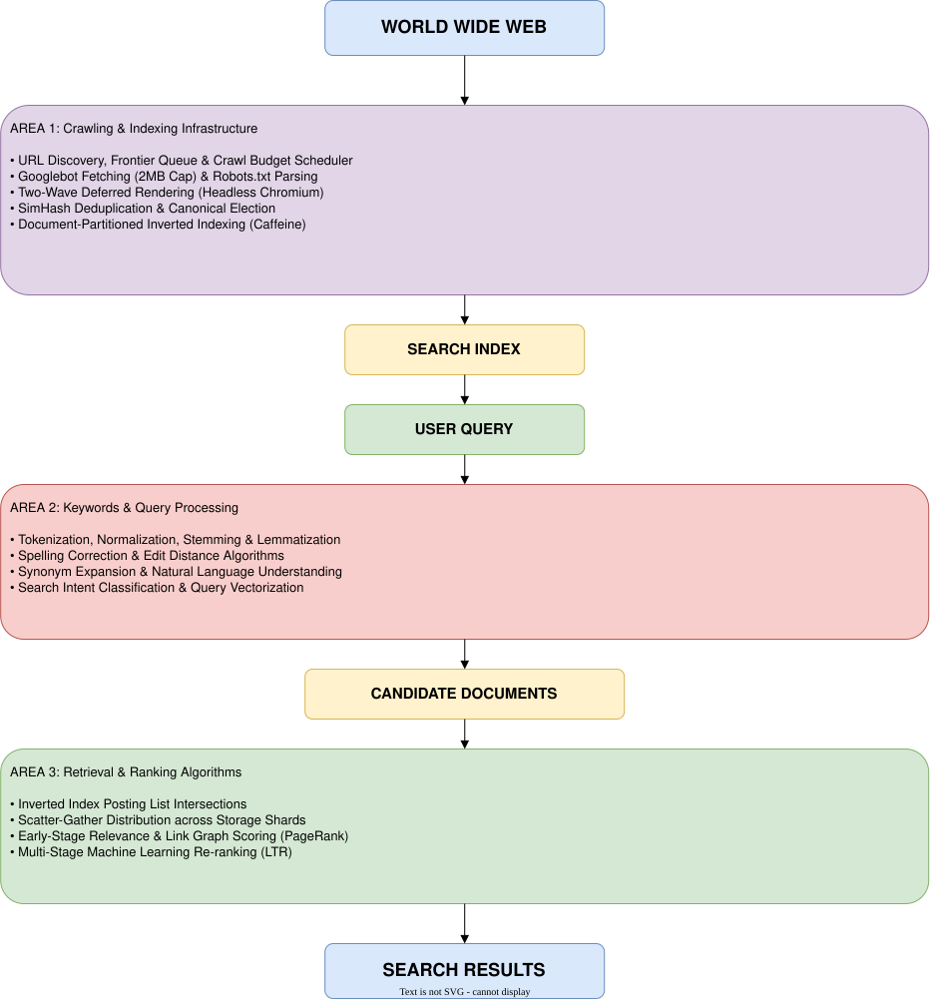

# M-01 Team_Y Case-01

**Case type:** Product/technical outcome  
**Status:** Completed  

**Contributors and roles**
* **Madhu Khanal:** Area 1 Lead — Crawling & Indexing Infrastructure
* **Arun Rawal:** Area 2 Lead — Keywords & Query Processing
* **Ganesh Saud:** Area 3 Lead — Retrieval & Ranking Algorithms

---

### Problem or hypothesis

**Problem:**  
The public web consists of hundreds of trillions of unindexed, dynamic documents scattered across millions of independent servers with no central directory or master catalog. Querying target web servers in real time when a user types a query is mathematically and operationally impossible: a single synchronous HTTP request across public WAN incurs 100 ms to 2 s of network latency, while target servers frequently crash, rate-limit requests, or serve complex client-side JavaScript. 

To deliver query results in under 200 milliseconds, Google Search must solve three compounding engineering bottlenecks before a user ever submits a search term:
1. **Ingestion & Indexing (Area 1):** Continuously discovering, fetching, rendering, and deduplicating unstructured web documents, then organizing them into a searchable, compressed lookup structure.
2. **Query Intelligence (Area 2):** Parsing ambiguous, misspelled, or natural-language user queries, extracting core search terms, expanding intent, and converting plain text into query execution vectors.
3. **Retrieval & Ranking (Area 3):** Scanning billions of candidate documents in milliseconds, applying link-graph authority analysis and deep learning relevance models, and ordering results by relevance.

**Hypothesis:**  
Decoupling web ingestion (asynchronous crawling, deferred headless browser rendering, and incremental inverted indexing) from query processing (intent expansion, token normalization) and multi-stage candidate retrieval/ranking (scatter-gather candidate generation followed by machine-learned scoring) enables sub-second search across the unbounded open web at global scale.

---

### Context and constraints

* **Product stage:** Global production infrastructure serving billions of daily queries.
* **Scale and Mutation Rate:** Hundreds of trillions of unique URLs. Pages are created, updated, or deleted continuously, creating a perpetual synchronization problem between the live web and the stored index.
* **Host Politeness & Server Limits:** Crawlers must strictly observe per-domain request limits. Oversaturating target host servers causes TCP connection drops, HTTP 503 throttling errors, or IP-level blocking.
* **Compute Bottlenecks:** Executing client-side JavaScript (React, Vue, Angular) via Headless Chromium browser instances consumes massive CPU and RAM resources. JS rendering must not block the main crawler pipeline.
* **Data Redundancy:** Over 30% of public web URLs contain duplicate or near-duplicate text (tracking parameters, print versions, scraper mirrors) that must be filtered out before indexing.
* **Strict Query Latency:** The end-to-end processing budget for query understanding, candidate retrieval, ranking, and snippet generation is capped at under 200 milliseconds.

---

### Approach

The team divided the search engine architecture into three specialized, interconnected technical areas:

   

#### Area 1 — Crawling & Indexing Infrastructure (Madhu Khanal)
* **URL Discovery & Scheduling:** URLs are gathered from seed lists, XML sitemaps, HTTP 301/302 redirects, and extracted page hyperlinks (`<a href="...">`). Candidate URLs are deduplicated via Bloom filters and prioritized in the URL Frontier.
* **Crawl Budget Allocation:** Crawling is throttled per domain by combining **Crawl Capacity** (server response time and HTTP 503 limits) and **Crawl Demand** (PageRank authority and historical change frequency).
* **Two-Wave Deferred Rendering:** Static HTML is tokenized and indexed immediately in the First Wave. Pages requiring client-side JavaScript execution are routed to a secondary queue, where Headless Chromium instances execute scripts and extract dynamically rendered DOM nodes during the Second Wave.
* **SimHash Deduplication & Inverted Indexing:** Rendered text is fingerprinted using 64-bit SimHash algorithms. Unique content is organized into a document-partitioned Inverted Index stored on distributed key-value infrastructure (Bigtable/Colossus).
* **Incremental Updates (Caffeine):** Replaced legacy periodic MapReduce batch jobs with a continuous transactional update pipeline, reducing document indexing delays from weeks down to minutes.

#### Area 2 — Keywords & Query Processing (Arun Rawal)
* **Text Normalization Pipeline:** Raw search strings undergo tokenization, lowercasing, accent stripping (`café` -> `cafe`), stop-word evaluation, and stemming/lemmatization to isolate core root terms.
* **Spelling Correction & Edit Distance:** Typos are detected and corrected in real time using probabilistic language models, edit-distance metrics, and query-log trie structures.
* **Synonym Expansion & Intent Classification:** Queries are mapped against deep synonym databases and intent classifiers to interpret user goal states (Informational, Navigational, Transactional, or Local).
* **Query Vectorization:** Plain-text inputs are converted into structured execution vectors, ensuring the system retrieves relevant documents even when pages do not contain the exact matching words typed by the user.

#### Area 3 — Retrieval & Ranking Algorithms (Ganesh Saud)
* **Scatter-Gather Candidate Generation:** Query vectors are broadcast to thousands of distributed index shards in parallel. Aggregator nodes execute posting list intersections ($O(K)$ lookup) to retrieve a preliminary pool of matching candidate documents.
* **Early-Stage Scoring:** Candidates are filtered down using lightweight algorithms, evaluating positional proximity, term frequency (TF-IDF/BM25 variants), structural zone weights (Title, Headings, Anchor text), and global link-graph authority (PageRank).
* **Late-Stage Machine Learning Re-ranking:** The top candidate pool (~1,000 documents) is passed to heavy Learning-to-Rank (LTR) and neural semantic relevance models to compute final ordinal scores.
* **SERP Assembly:** Top-ranked documents are enriched with dynamic snippet generation, sitelinks, and contextual features before being returned to the user.

---

### Engineering Decisions

**Decision 1 — Batch MapReduce vs. Continuous Incremental Indexing (Area 1)**
* **Options:** Periodically rebuild the complete search index using batch MapReduce jobs vs. applying document updates incrementally to distributed storage (Caffeine/Percolator model).
* **Chosen:** Continuous incremental indexing on Bigtable.
* **Why:** Batch indexing caused content staleness of days or weeks. Incremental updates reduced average document processing latency by ~100x and cut index staleness by nearly 50%.
* **Trade-off:** Incremental writes carry ~4x higher per-write system overhead due to distributed transactional locking.

**Decision 2 — Exact String Matching vs. Semantic Synonym Expansion (Area 2)**
* **Options:** Require strict term matching against the index vs. expanding queries using synonym matrices and intent vectors.
* **Chosen:** Semantic expansion and intent vectorization.
* **Why:** Pure keyword matching fails on conversational or natural-language queries where users use colloquial phrasing instead of precise site terminology.
* **Trade-off:** Increases candidate set size and requires strict multi-stage scoring to avoid retrieving off-topic documents.

**Decision 3 — Term-Partitioned vs. Document-Partitioned Index Sharding (Area 3)**
* **Options:** Term-Partitioned Index (each storage node holds all documents for specific words) vs. Document-Partitioned Index (each storage node holds a complete inverted index for a subset of documents).
* **Chosen:** Document-Partitioned Indexing.
* **Why:** Document partitioning isolates indexing writes locally to a single node, maximizing continuous ingestion throughput.
* **Trade-off:** Queries must be broadcast across all shards in a scatter-gather pattern, placing high throughput demands on network aggregation nodes.

---

### Evidence

**Product/design/code/test/deployment links:**
* [Google Search Central — In-Depth Guide to How Google Search Works](https://developers.google.com/search/docs/fundamentals/how-search-works)
* [Google Search Central — JavaScript SEO Basics & Rendering Pipeline](https://developers.google.com/search/docs/crawling-indexing/javascript/javascript-seo-basics)
* [Google Search Central Blog — Infrastructure Update: Our New Search Index Caffeine](https://developers.google.com/search/blog/2010/06/our-new-search-index-caffeine)
* [Google Research — MapReduce: Simplified Data Processing on Large Clusters](https://research.google/pubs/mapreduce-simplified-data-processing-on-large-clusters/)
* [Google Research — Bigtable: A Distributed Storage System for Structured Data](https://research.google/pubs/bigtable-a-distributed-storage-system-for-structured-data/)
* [Google Research — Detecting Near-Duplicates for Web Crawling](https://research.google/pubs/pub33026/)
* [Google Research — Web Search for a Planet Architecture](https://research.google/pubs/web-search-for-a-planet-the-google-cluster-architecture/)
* [Stanford InfoLab — The Anatomy of a Large-Scale Hypertextual Web Search Engine](http://infolab.stanford.edu/~backrub/google.html)

**Screenshot or demo:**  
End-to-End System Flow:  
 

**Measurement or acceptance results:**
* **End-to-End Latency:** Sub-200ms query processing time across billions of indexed web pages.
* **Ingestion Throughput:** Incremental pipeline (Caffeine) processes recrawled pages and updates search listings within minutes.
* **Storage Efficiency:** 64-bit SimHash Hamming distance checks group >30% of duplicate web URLs into single canonical index entries.

---

### What changed

* **Area 1 Shift:** Transitioned from periodic batch index rebuilds (MapReduce) to continuous incremental processing (Caffeine on Bigtable), and adopted Mobile-First crawling (Googlebot Smartphone) with two-wave deferred rendering.
* **Area 2 Shift:** Evolved from rigid keyword string matching to deep natural language intent understanding, synonym expansion, and entity vectorization.
* **Area 3 Shift:** Moved from simple heuristic scoring (pure PageRank and term frequency) to a multi-stage architecture where lightweight filters pass candidate pools to deep Learning-to-Rank (LTR) neural models.

---

### Result and lessons

**What improved:**
* System ingestion throughput increased by isolating raw network fetches from heavy Headless Chromium rendering.
* Index freshness improved from days or weeks down to minutes through continuous incremental posting list updates.
* Search quality improved significantly by combining link-graph authority (PageRank) with deep semantic intent matching.

**What did not work:**
* Executing client-side JavaScript synchronously on every initial fetch created massive crawler queue backups and server timeouts.
* Running heavy machine-learning ranking models over raw un-pruned document sets degraded query latency past accepted limits.

**What the team will do differently:**
* Offload compute-heavy tasks (JS rendering, deep ML ranking) downstream from critical path I/O operations.
* Utilize space-efficient probabilistic data structures (Bloom filters for URL queues, SimHash for deduplication) to eliminate disk memory bottlenecks.
* Implement multi-stage candidate reduction, using lightweight mathematical filters to prune document candidate sets before invoking heavy ML re-ranking models.

---

### Follow-up

* **Owner:** Madhu Khanal
* **Next action:** Preparation For Requirements & System Analysis
* **Due week:** 03-Sep-2026